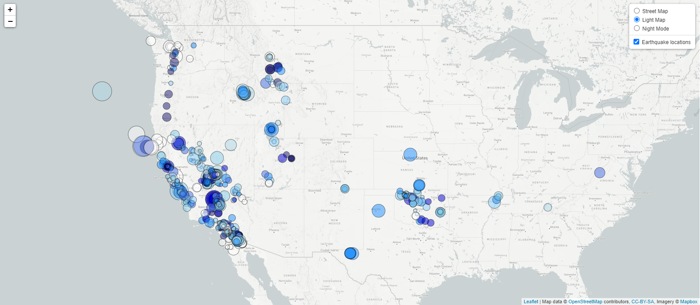

## Background

The USGS is responsible for providing scientific data about natural hazards, the health of our ecosystems and environment; and the impacts of climate and land-use change. Their scientists develop new methods and tools to supply timely, relevant, and useful information about the Earth and its processes. 

The USGS is interested in building a new set of tools that will allow them visualize their earthquake data. They collect a massive amount of data from all over the world each day, but they lack a meaningful way of displaying it. The purpose of this challenge is to visualize their data in a way that will allow them to better educate the public and other government organizations on issues facing our planet.

### Level 1: Basic Visualization

Your first task is to visualize an earthquake data set.

1. **Datasets**

   

   The USGS provides earthquake data in a number of different formats, updated every 5 minutes. Visit the [USGS GeoJSON Feed](http://earthquake.usgs.gov/earthquakes/feed/v1.0/geojson.php) page and pick a data set to visualize. This project utilized 'All Earthquakes from the Past 7 Days'.

   

2. **Import & Visualize the Data**

   Create a map using Leaflet that plots all of the earthquakes from your data set based on their longitude and latitude.

Your data markers should reflect the magnitude of the earthquake by their size color.

- - -
